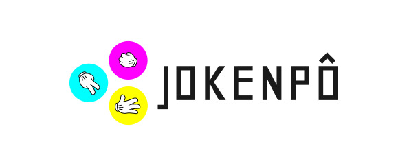

# Rock, paper, scissors



[](./LICENSE)
[](https://travis-ci.org/gerardo-junior/jokenpo)

```
    [+] AUTOR:        Gerardo Junior
    [+] SITE:         https://gerardo-junior.com/
    [+] EMAIL:        me@gerardo-junior.com
    [+] GITHUB:       https://github.com/gerardo-junior/jokenpo
    [+] TELEGRAM:     @MrGerardoJunior
```

### [DEMO](https://jokenpo.gerardo-junior.com)

### How to build 

You need to:

 * [nodejs](https://nodejs.org/en/) 8.1.3
 * [yarn](https://yarnpkg.com/pt-BR/) ~1.5
 
#### ... and run the folder after cloning

```bash
$ yarn install
$ yarn run build # or yarn run start
```
#### ... or build with docker

```bash
$ docker-compose up # open in your browser http://localhost:8000/
```
### How to improve:

```bash
$ yarn run dev
```
### Run the tests:

```bash
$ yarn run test
```

####  License
This project is under the [GPL-3.0 license](./LICENSE).
